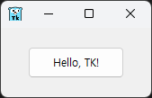

파이썬에서는 Tkinter와 같은 기본 GUI 라이브러리가 내장되어 있다. Go에서도 Tcl/Tk는 역시 존재하는데, 그 기초를 간단하게 연습해보자.

## Hello, Tk!
먼저 간단한 Hello, TK!를 만들어보자.
```go
package main

import tk "modernc.org/tk9.0"

func main() {
	tk.Pack(
		tk.TButton(
			tk.Txt("Hello, TK!"),
			tk.Command(func() {
				tk.Destroy(tk.App)
			})),
		tk.Ipadx(10), tk.Ipady(5), tk.Padx(15), tk.Pady(10),
	)
	tk.App.Wait()
}
```


<span style="font-size:80%;color:darkslategray"> 실행결과 </span>

--------

먼저 제시된 예제 코드와 실행결과를 보자.

파이썬 TK를 접해본 코딩 입문자라면,

창 안에 패킹을 위한 위젯이 있거나, 바로 창 하위로 위젯이 패킹되고

    => 그 위젯의 종류에 따라 라벨 등이 또 그 안에 들어가는 것을 알고 있을 것이다.

<span style="font-size:80%;color:darkslategray">Ipadx,Ipady는 Internal padding의 줄임말로, 이것은 내부 위젯들의 패딩을 늘린다.  여기서는 Button의 패딩을 늘리게 된다. </span>


일단 이 라이브러리에는 창 구조체(struct Window)가 있고,

App이라는 변수가 최상위창을 담당하고, 라이브러리 내에 미리 선언되어 있다.

따라서 tk.App.Wait()를 끊어주는 것이 tk.App.Destroy()가 되고, 최상위 창을 닫아주는 동작이다.


이제 기본적인 틀을 알아보자.

GitLab에 있는 예제 몇 가지를 다뤄 보겠다.

예제는 \_examples 폴더에 있다.


## SVG 다루기: svg.go

이것은 SVG 파일을 라벨 위젯에 넣어 띄우는 예제이다.


```go
package main

import . "modernc.org/tk9.0"

// https://en.wikipedia.org/wiki/SVG
const svg = `<?xml version="1.0" encoding="UTF-8" standalone="no"?>
<!DOCTYPE svg PUBLIC "-//W3C//DTD SVG 1.1//EN" "http://www.w3.org/Graphics/SVG/1.1/DTD/svg11.dtd">
<svg width="391" height="391" viewBox="-70.5 -70.5 391 391" xmlns="http://www.w3.org/2000/svg" xmlns:xlink="http://www.w3.org/1999/xlink">
<rect fill="#fff" stroke="#000" x="-70" y="-70" width="390" height="390"/>
<g opacity="0.8">
	<rect x="25" y="25" width="200" height="200" fill="lime" stroke-width="4" stroke="pink" />
	<circle cx="125" cy="125" r="75" fill="orange" />
	<polyline points="50,150 50,200 200,200 200,100" stroke="red" stroke-width="4" fill="none" />
	<line x1="50" y1="50" x2="200" y2="200" stroke="blue" stroke-width="4" />
</g>
</svg>`

func main() {
	Pack(Label(Image(NewPhoto(Data(svg)))), //이 부분을 아래에서 설명
		TExit(), //Exit 버튼
		Padx("1m"), Pady("2m"), Ipadx("1m"), Ipady("1m"))
	App.Center().Wait()
}
```


<span style="font-size:80%;color:darkslategray"> 실행결과 </span>

이 라이브러리에서 SVG를 다루는 방법은
1. SVG 파일의 내용을 스트링으로 읽어둔다(혹은 위의 예시처럼 내장한다).
2. 이 내용을 Data 함수에 넘긴다. 이를 통해 입력받은 자료를 옵션이 포함된 스트링으로 변환한다.( -data 옵션)
3. 이 bytes 값이 NewPhoto 함수에 전달된다. NewPhoto는 Tck/Tk 이미지를 표현하는 Img 구조체 포인터를 반환한다.
4. Image 함수를 지나면 Img 구조체 포인터는 -Image 옵션을 앞에 둔 채로 스트링으로 변환된다.
5. 구조체 RAW 값을 담은 스트링을 전달한 이유는 Label 위젯으로 만들기 위함으로 보인다.

또한 구현된 코드를 보면 ico, png도 유사한 방식으로 처리된다. (아래에 언급)

## PNG 처리: photo.go


<span style="font-size:80%;color:darkslategray"> 실행결과 </span>
```go
package main

import _ "embed"
import . "modernc.org/tk9.0"

//go:embed gopher.png
var gopher []byte

func main() {
	Pack(Label(Image(NewPhoto(Data(gopher)))),
		TExit(),
		Padx("1m"), Pady("2m"), Ipadx("1m"), Ipady("1m"))
	App.Center().Wait()
}
```
1. 임베딩된 gopher.png를 마찬가지로 옵션이 포함된 스트링 타입으로 변환한다.
2. NewPhoto 함수로 \*Img 타입으로 변환한다.
3. Image 함수를 지나 RAW 스트링으로 변환, 이것을 라벨 위젯으로 만들어 줌

<b><span style="font-size=90%"> *.ico도 동일 </span></b>
결국 SVG 포맷과 달라진 부분이라면 Data 함수 내에서 실제 일어나는 일 뿐이다.

그런데 이 때, "옵션이 포함된 스트링"은 무엇일까?

```go
type rawOption string
```

앞서 말한 옵션이 포함된 스트링은 그저 포매팅된 스트링일 뿐이다.

```go
func (w *Window) optionString(_ *Window) string {
	return w.String()
}
```


optionString 메서드 함수의 반환값도 스트링이다.
이 때 optionString은 창(Window) 포인터에 대한 메서드 함수이다.

이제 Data 함수 내부를 간략하게 살펴보자.

```go
func Data(val any) Opt {
	switch x := val.(type) {
	case []byte:
		switch {
		case bytes.HasPrefix(x, pngSig):
			// ok
		case bytes.HasPrefix(x, icoSig):
			b := bytes.NewBuffer(x)
			img, err := ico.Decode(bytes.NewReader(x))
			if err != nil {
				fail(err)
				return rawOption("")
			}

			b.Reset()
			if err := png.Encode(b, img); err != nil {
				fail(err)
				return rawOption("")
			}

			val = b.Bytes()
		}
	}
	return rawOption(fmt.Sprintf(`-data %s`, optionString(val)))
}
```

코드를 확인해 보니, ico 혹은 png일 경우에는 인코딩/디코딩이 있다. ico나 png가 아닐 시에는 특별한 인코딩/디코딩 작업을 거치지 않고 바로 bytes형으로 변환된 스트링을 -data 옵션만 붙여서 Data 함수의 산물이라는 것을 밝힐 뿐이다.


